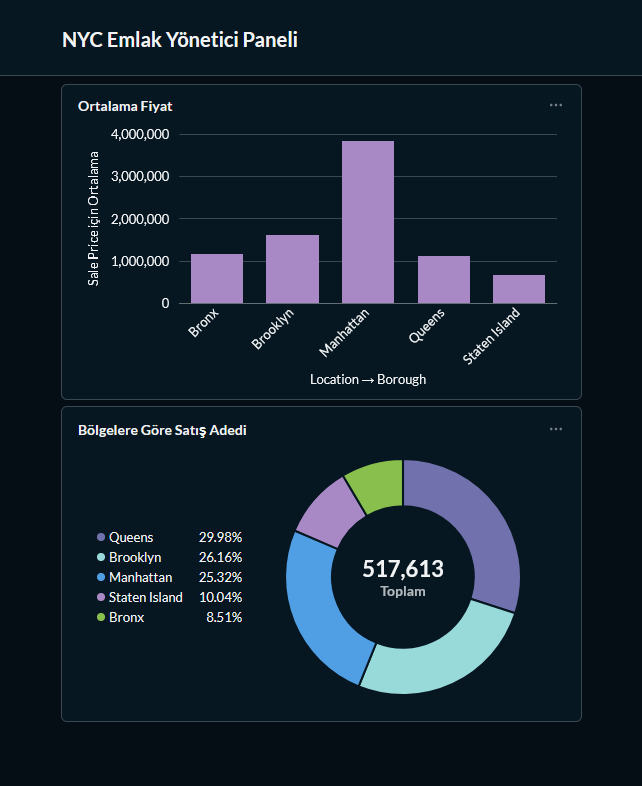

# NYC Real Estate End-to-End ELT Pipeline

This repository showcases a professional Data Engineering project that automates the collection, transformation, and visualization of New York City real estate sales data. 

The project follows the **Medallion Architecture** (Bronze, Silver, Gold layers) and utilizes a modern tech stack to provide actionable business insights through an automated dashboard.

---

## Project Overview

The goal of this project was to build a robust, scalable data pipeline that:
1. **Extracts** raw monthly sales data from NYC Open Data.
2. **Loads** it into a Cloud Data Warehouse (**Neon PostgreSQL**).
3. **Transforms** raw data into a structured **Star Schema** (Fact & Dimension tables).
4. **Orchestrates** the entire flow using **Apache Airflow**.
5. **Visualizes** the results using **Metabase** for Business Intelligence.

---

## Tech Stack

* **Language:** Python (Pandas, SQLAlchemy)
* **Orchestration:** Apache Airflow
* **Containerization:** Docker & Docker Compose
* **Database:** PostgreSQL (Cloud-hosted via **Neon**)
* **Business Intelligence:** Metabase
* **Data Modeling:** Star Schema / Medallion Architecture

---

## The Learning Journey

This project served as a comprehensive learning path for modern Data Engineering. Key milestones achieved during this process:

* **Infrastructure as Code:** Configured a multi-container environment using Docker to keep Airflow and Metabase isolated and reproducible.
* **Data Modeling:** Moved beyond flat files to design a **Star Schema**, creating separate `fact_sales`, `dim_location`, and `dim_property` tables to optimize query performance.
* **Automated Orchestration:** Developed a DAG (Directed Acyclic Graph) in Airflow to handle dependencies, ensuring that transformations only occur after successful data loading.
* **Cloud Integration:** Managed remote database connections and environment variables safely using `.env` configurations.
* **BI & Metadata Management:** Learned how to map raw database IDs into human-readable labels in Metabase to create professional-grade executive dashboards.

---

## Business Intelligence Dashboard

The final product is a dynamic dashboard that allows stakeholders to analyze the NYC market at a glance.

**Key Insights Visualized:**
* **Average Sale Price by Borough:** Comparing the premium markets (Manhattan) vs. emerging markets (Brooklyn/Queens).
* **Sales Volume Distribution:** Tracking which areas have the most market activity.
* **Metadata Mapping:** All numeric codes were mapped to actual borough names for better readability.

---

## Pipeline Architecture

1.  **Extract:** Python script fetches the latest CSV data from the NYC Open Data portal.
2.  **Load (Bronze):** Raw data is ingested into a `staging_sales` table in Neon DB.
3.  **Transform (Silver/Gold):** SQL procedures clean the data (handling nulls and types) and populate the Star Schema tables.
4.  **Visualize:** Metabase queries the Gold layer to present the final metrics.

